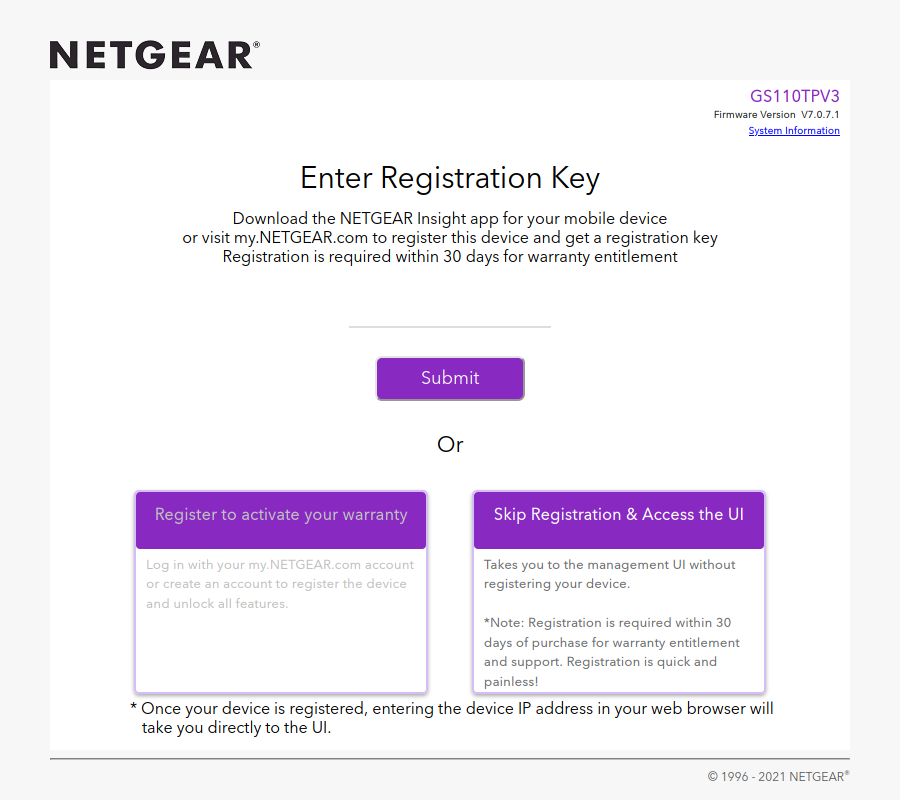
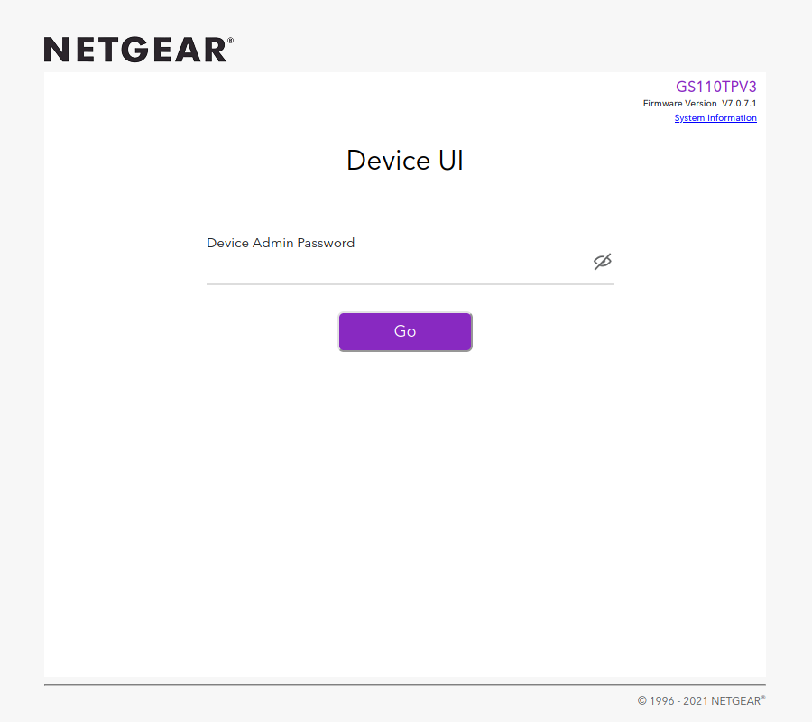

# NETGEAR Registration Key Generator

This script generates registration keys for NETGEAR Smart Managed Pro switches.

Registration keys were initially required for full access to the local management UI of the switch,
but this was made optional in later firmware revisions. However, you still have to click through a
page encouraging you to register the switch each time you want to access the management UI:



NETGEAR intends for the user to create an account on the NETGEAR website and register the switch using
its serial number. The registration key will be available on the website once the switch is registered.

The registration key is unique to each device as it is generated using the device's serial number.

Once the registration key has been entered, future visits to the local management UI will take you
directly to the login page:



## Supported Devices

This script has been tested on a GS110TPv3, the firmware of which is shared with the GS108Tv3 and GS110TPP.

Based mostly on an incomplete list found in a NETGEAR support article,
the following switches will ask for a registration key:

- GS108Tv3
- GS110TPP
- GS110TPv3
- GS110TUP
- GS710TUP
- GS716TP
- GS716TPP
- GS724TPP
- GS724TPv2
- GS728TPPv2
- GS728TPv2
- GS752TPP
- GS752TPv2
- MS510TXM
- MS510TXUP

Registration keys may also be requested by the NETGEAR WAX204 wireless access point
([source](https://kb.netgear.com/000062620/How-do-I-gain-full-access-to-my-WAX204-using-a-registration-key)). 

If you find a product model that will not accept a registration key generated by this script,
please open an issue.

## Usage

Run the script with the switch serial number provided as the argument:

```
$ python3 main.py 1234567890ABC
9489A
```

## Further Reading

- [NETGEAR Support: What features of my NETGEAR Smart Managed Pro Switch can I access without registering?](https://kb.netgear.com/000061174/What-features-of-my-NETGEAR-Smart-Managed-Pro-Switch-can-I-access-without-registering)
- [NETGEAR Support: How do I find my NETGEAR registration key?](https://kb.netgear.com/000061819/How-do-I-find-my-NETGEAR-registration-key)
- [NETGEAR Support: How do I gain full access to my NETGEAR Smart Managed Pro switch using my registration key?](https://kb.netgear.com/000061821/How-do-I-gain-full-access-to-my-NETGEAR-Smart-Managed-Pro-switch-using-my-registration-key)
- [NETGEAR Community: Why We Require Registration on Smart Pro Switches](https://community.netgear.com/t5/Plus-and-Smart-Switches-Forum/Why-We-Require-Registration-on-Smart-Pro-Switches/m-p/1839465)
- [Hacker News: Netgear Firmware Requires Online Registration](https://news.ycombinator.com/item?id=24530009)
